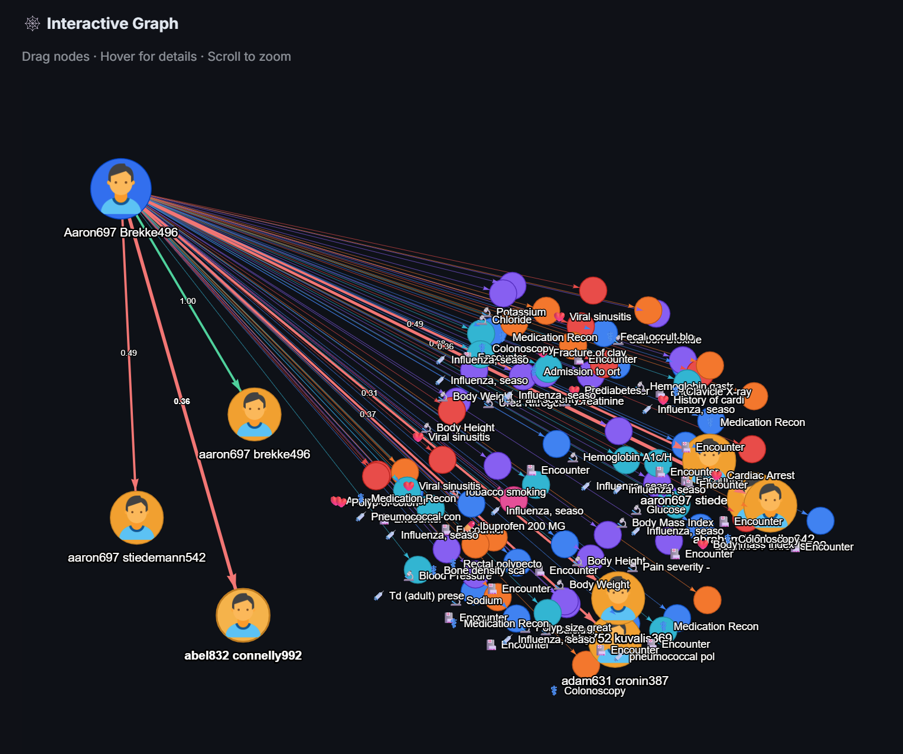

# Patient Matching Service (MPI)

A comprehensive **Master Patient Index (MPI)** solution for healthcare data interoperability, implementing deterministic, probabilistic, and AI-enhanced patient matching algorithms with a modern web-based dashboard.


## 🎯 Overview

This service provides comprehensive patient identity resolution through multiple matching strategies:

| Feature | Description |
|---------|-------------|
| **Graph Database Storage** | Azure Cosmos DB Gremlin or Neo4j for patient data with relationships |
| **Deterministic Matching** | Exact matches on identifiers (SSN, MRN, DOB, phone, email) |
| **Probabilistic Matching** | Similarity algorithms (Jaro-Winkler, Levenshtein, Soundex, Metaphone) |
| **AI-Enhanced Matching** | OpenAI embeddings for semantic similarity |
| **LLM Analysis** | GPT-4o for intelligent match analysis with reasoning |
| **EMPI Management** | Enterprise Master Patient Index record creation and maintenance |
| **Human Review Workflow** | Queue for ambiguous matches requiring manual review |
| **Web Dashboard** | Streamlit-based UI for viewing and managing match results |
| **AI Agent Chat** | Conversational agent (Azure AI Foundry) embedded in the dashboard |
| **MCP Server** | Model Context Protocol server for IDE/tool integration |

## 🏗️ Architecture

```
┌─────────────────────────────────────────────────────────────────────────────────────────┐
│                            PATIENT MATCHING SERVICE ARCHITECTURE                         │
└─────────────────────────────────────────────────────────────────────────────────────────┘

                                    ┌──────────────────┐
                                    │   FHIR Bundles   │
                                    │   (JSON Files)   │
                                    └────────┬─────────┘
                                             │
                                             ▼
┌─────────────────────────────────────────────────────────────────────────────────────────┐
│                                     DATA INGESTION LAYER                                 │
│  ┌─────────────────────┐  ┌─────────────────────┐  ┌─────────────────────────────────┐  │
│  │   FHIR Loader       │  │   Data Transformer  │  │   Cosmos DB Loader              │  │
│  │   (fhir_loader.py)  │──│   & Normalizer      │──│   (load_fhir_to_cosmos.py)      │  │
│  └─────────────────────┘  └─────────────────────┘  └─────────────────────────────────┘  │
└─────────────────────────────────────────────────────────────────────────────────────────┘
                                             │
                                             ▼
┌─────────────────────────────────────────────────────────────────────────────────────────┐
│                                     MATCHING ENGINE                                      │
│  ┌─────────────────────────────────────────────────────────────────────────────────┐    │
│  │                            PatientMatcher (matching.py)                          │    │
│  │  ┌───────────────────┐  ┌───────────────────┐  ┌───────────────────────────────┐│    │
│  │  │  DETERMINISTIC    │  │  PROBABILISTIC    │  │    AI-ENHANCED                ││    │
│  │  │                   │  │                   │  │                               ││    │
│  │  │  • Enterprise ID  │  │  • Jaro-Winkler   │  │  ┌─────────────────────────┐  ││    │
│  │  │  • SSN Match      │  │  • Levenshtein    │  │  │  OpenAI Embeddings      │  ││    │
│  │  │  • MRN Match      │  │  • Soundex        │  │  │  (text-embedding-ada)   │  ││    │
│  │  │  • DOB Match      │  │  • Metaphone      │  │  └─────────────────────────┘  ││    │
│  │  │  • Phone/Email    │  │  • Address Token  │  │  ┌─────────────────────────┐  ││    │
│  │  │                   │  │    Matching       │  │  │  GPT-4o LLM Analysis    │  ││    │
│  │  │  Weight: 0.4      │  │  Weight: 0.5      │  │  │  (Intelligent Scoring)  │  ││    │
│  │  └───────────────────┘  └───────────────────┘  │  └─────────────────────────┘  ││    │
│  │                                                │  Weight: 0.1 + 0.2 (LLM)      ││    │
│  │                                                └───────────────────────────────┘│    │
│  └─────────────────────────────────────────────────────────────────────────────────┘    │
│                                             │                                            │
│                                             ▼                                            │
│  ┌─────────────────────────────────────────────────────────────────────────────────┐    │
│  │                              CONFIDENCE CLASSIFICATION                           │    │
│  │       ┌─────────────────┐    ┌─────────────────┐    ┌─────────────────┐         │    │
│  │       │   AUTO_MERGE    │    │  HUMAN_REVIEW   │    │    NO_MATCH     │         │    │
│  │       │   Score ≥ 0.85  │    │  0.65 ≤ S < 0.85│    │   Score < 0.65  │         │    │
│  │       └─────────────────┘    └─────────────────┘    └─────────────────┘         │    │
│  └─────────────────────────────────────────────────────────────────────────────────┘    │
└─────────────────────────────────────────────────────────────────────────────────────────┘
                                             │
                                             ▼
┌─────────────────────────────────────────────────────────────────────────────────────────┐
│                                      STORAGE LAYER                                       │
│  ┌─────────────────────────────────────────────────────────────────────────────────┐    │
│  │                     Azure Cosmos DB (Gremlin API + NoSQL API)                    │    │
│  │  ┌─────────────────────────────┐    ┌─────────────────────────────────────────┐ │    │
│  │  │   GREMLIN GRAPH             │    │   NoSQL CONTAINER                       │ │    │
│  │  │   (patients)                │    │   (match_results)                       │ │    │
│  │  │                             │    │                                         │ │    │
│  │  │  (:Patient)──[:HAS_ID]──▶   │    │   {                                     │ │    │
│  │  │       │     (:Identifier)   │    │     "id": "match-uuid",                 │ │    │
│  │  │       │                     │    │     "patient1_id": "...",               │ │    │
│  │  │  [:HAS_ADDR]──▶(:Address)   │    │     "patient2_id": "...",               │ │    │
│  │  │       │                     │    │     "score": 0.92,                      │ │    │
│  │  │  [:LINKED_TO]──▶(:EMPI)     │    │     "confidence": "auto_merge",         │ │    │
│  │  │       │                     │    │     "details": { ... }                  │ │    │
│  │  │  [:POTENTIAL_MATCH]──▶      │    │   }                                     │ │    │
│  │  │       (:Patient)            │    │                                         │ │    │
│  │  └─────────────────────────────┘    └─────────────────────────────────────────┘ │    │
│  └─────────────────────────────────────────────────────────────────────────────────┘    │
└─────────────────────────────────────────────────────────────────────────────────────────┘
                                             │
              ┌──────────────────────────────┼──────────────────────────────┐
              ▼                              ▼                              ▼
┌─────────────────────────┐    ┌─────────────────────────┐    ┌─────────────────────────┐
│      REST API           │    │    STREAMLIT DASHBOARD  │    │    CLI SCRIPTS          │
│     (FastAPI)           │    │    (dashboard.py)       │    │    (run_matching.py)    │
│                         │    │                         │    │                         │
│  • POST /patients       │    │  📊 Dashboard Overview  │    │  • Load FHIR data       │
│  • POST /match          │    │  🔍 Match Results       │    │  • Run batch matching   │
│  • GET /reviews/pending │    │  👥 Patients List       │    │  • Export results       │
│  • POST /empi/merge     │    │  �️ Patient Graph       │    │                         │
│  • GET /config/weights  │    │  📋 Review Queue        │    │                         │
│                         │    │  🤖 Agent Chat          │    │                         │
│                         │    │  ⚙️ Settings            │    │                         │
│                         │    │                         │    │                         │
│  http://localhost:8000  │    │  http://localhost:8503  │    │  python scripts/...     │
└─────────────────────────┘    └─────────────────────────┘    └─────────────────────────┘

┌─────────────────────────────────────────────────────────────────────────────────────────┐
│                                   AZURE SERVICES                                         │
│  ┌──────────────┐  ┌──────────────┐  ┌──────────────┐  ┌───────────────────────────────┐│
│  │ Cosmos DB    │  │ Azure OpenAI │  │ Container    │  │ Log Analytics               ││
│  │ (Gremlin +   │  │ (GPT-4o +    │  │ Apps         │  │ Workspace                   ││
│  │  NoSQL)      │  │  Embeddings) │  │              │  │                             ││
│  └──────────────┘  └──────────────┘  └──────────────┘  └───────────────────────────────┘│
│                    ┌──────────────┐                                                      │
│                    │ AI Foundry   │                                                      │
│                    │ Agent Service│                                                      │
│                    └──────────────┘                                                      │
└─────────────────────────────────────────────────────────────────────────────────────────┘
```

## 🖥️ Web Dashboard (Streamlit)

The Patient Matching Service includes a full-featured **Streamlit dashboard** for visualizing and managing match results.


### Dashboard Features

| Page | Description |
|------|-------------|
| **📊 Dashboard** | Overview with key metrics, score distribution charts, and recent matches |
| **🔍 Match Results** | Filterable list of all matches with detailed score breakdowns |
| **👥 Patients** | Browse and search loaded patients with clinical data |
| **🕸️ Patient Graph** | Interactive graph visualization of patient relationships (streamlit-agraph) |
| **📋 Review Queue** | Pending human review items with approve/reject actions |
| **🤖 Agent Chat** | Conversational AI agent for natural language patient queries |
| **⚙️ Settings** | Configure match weights, thresholds, and theme |

### Match Details View

When viewing match details, the dashboard provides **6 detailed tabs**:

| Tab | Content |
|-----|---------|
| **📊 Summary** | Visual score breakdown with progress bars for all components |
| **🎯 Deterministic** | Exact identifier matches (SSN, MRN, Enterprise ID, DOB) |
| **📈 Probabilistic** | Fuzzy matching scores (Jaro-Winkler, Soundex, Metaphone, Levenshtein) |
| **🧠 AI/Embeddings** | OpenAI embedding cosine similarity scores |
| **💬 LLM Analysis** | GPT-4o match analysis with reasoning and recommendations |
| **📋 Raw Data** | Full JSON match data for debugging |

### Running the Dashboard

```bash
# Start the dashboard
python -m streamlit run app/dashboard.py --server.port 8503

# Or with headless mode (no browser prompt)
streamlit run app/dashboard.py --server.port 8503 --server.headless true
```

Access at: **http://localhost:8503**

### Dashboard Layout

```
┌─────────────────────────────────────────────────────────────────┐
│  🏥 Patient Matching Dashboard                                   │
├───────────────┬─────────────────────────────────────────────────┤
│               │                                                  │
│  Navigation   │  Total Patients: 97    Match Results: 70        │
│  ─────────────│  Auto Merge: 3         Pending Review: 0        │
│  📊 Dashboard │                                                  │
│  🔍 Results   │  ┌─────────────────────────────────────────────┐│
│  👥 Patients  │  │ Score Distribution        Confidence Dist.  ││
│  �️ Graph     │  │  ████████░░  0.8-1.0     🟢 auto_merge: 3   ││
│  📋 Review    │  │  ██████████  0.6-0.8     🟡 human_review: 0 ││
│  🤖 Agent     │  │  ████░░░░░░  0.4-0.6     🔴 no_match: 67    ││
│  ⚙️ Settings  │  └─────────────────────────────────────────────┘│
│  ✅ Connected │  └─────────────────────────────────────────────┘│
└───────────────┴─────────────────────────────────────────────────┘
```

## 📊 Matching Algorithms

### Matching Components

| Component | Method | Weight | Description |
|-----------|--------|--------|-------------|
| **Deterministic** | Enterprise ID exact | 1.0 | Unique enterprise identifier |
| | SSN exact match | 0.9 | Social Security Number |
| | MRN exact (same system) | 0.8 | Medical Record Number |
| | DOB exact match | 0.35 | Date of Birth |
| | Phone exact match | 0.3 | Primary phone number |
| | Email exact match | 0.3 | Email address |
| **Probabilistic** | Name (Jaro-Winkler) | 0.35 | Fuzzy name matching |
| | Address similarity | 0.15 | Token-based address comparison |
| | Phonetic (Soundex/Metaphone) | boost | Sound-alike name detection |
| **AI-Enhanced** | OpenAI embeddings | 0.1 | Semantic text similarity |
| | GPT-4o LLM analysis | 0.2 | Intelligent match reasoning |

### Confidence Classification

| Score Range | Confidence | Action |
|-------------|------------|--------|
| ≥ 0.85 | **🟢 Auto-Merge** | Automatically link to EMPI Record |
| 0.65 - 0.85 | **🟡 Human Review** | Queue for manual review |
| < 0.65 | **🔴 No Match** | Treat as separate patients |

### Score Calculation

```
Final Score = (Deterministic × 0.4) + (Probabilistic × 0.5) + (AI × 0.1)

With LLM enabled:
Final Score = (Traditional Score × 0.8) + (LLM Score × 0.2)
```

## 🤖 AI Agent (Microsoft Agent Framework)

The Patient Matching Service can be deployed as an **AI Agent** using the Microsoft Agent Framework, available both as a standalone CLI and embedded in the Streamlit dashboard.

### Features

- **Conversational Interface**: Ask questions naturally about patient matching
- **Dashboard Integration**: Agent Chat tab in the Streamlit dashboard for browser-based use
- **Azure AI Foundry Deployment**: Server-side agent hosted in Azure AI Foundry Agent Service
- **Multi-Patient Matching**: Find matches against all patients in the database
- **Match Decisions**: Approve or reject matches through conversation
- **Service Statistics**: Get real-time stats about the MPI

### Setup

```bash
# Install the Microsoft Agent Framework (preview)
pip install agent-framework-azure-ai --pre
```

### Environment Variables

```bash
# Azure OpenAI Configuration
export AZURE_OPENAI_ENDPOINT="https://your-resource.openai.azure.com/"
export AZURE_OPENAI_DEPLOYMENT="gpt-4o"

# Azure AI Foundry (for Foundry Agent Service)
export AZURE_AI_FOUNDRY_PROJECT_ENDPOINT="https://your-resource.services.ai.azure.com/api/projects/your-project"

# Database Configuration (Cosmos DB or Neo4j)
export PM_DB_TYPE="cosmos"  # or "neo4j"
export COSMOS_GREMLIN_ENDPOINT="your-account.gremlin.cosmos.azure.com"
export COSMOS_DATABASE="patient-matching-db"
export COSMOS_CONTAINER="patients"
export COSMOS_KEY="your-key"
```

### Usage

```python
import asyncio
from patient_matching.agent import create_patient_matching_agent

async def main():
    # Create the agent (uses AzureOpenAIChatClient)
    agent = create_patient_matching_agent()
    
    # Single query
    result = await agent.run("Find all matches for patient P123")
    print(result.text)
    
    # Compare two patients
    result = await agent.run("Compare patient abc-123 with patient xyz-456")
    print(result.text)
    
    # Get service statistics
    result = await agent.run("What are the current service statistics?")
    print(result.text)

asyncio.run(main())
```

### CLI Mode

```bash
# Run the agent in interactive mode (direct Azure OpenAI)
python -m src.patient_matching.agent

# Run with Azure AI Foundry Agent Service
python -m src.patient_matching.agent --foundry

# Example conversation:
# You: Find all potential matches for patient 92d2064d-11a2-44cc-843a-9547a3748eb4
# Agent: I found 5 potential matches for the patient:
#        1. Patient 3357f00c-... - Score: 0.95 (AUTO_MERGE)
#        2. Patient fc0159e8-... - Score: 0.95 (AUTO_MERGE)
#        ...
#        These matches have highly similar details, indicating they are likely duplicates.
```

### Agent Tools

| Tool | Description |
|------|-------------|
| `find_patient_matches` | Find potential matches for a patient (optional: search entire database) |
| `get_patient_details` | Get detailed patient information |
| `compare_two_patients` | Compare two specific patients with detailed scoring |
| `run_batch_matching` | Run matching for all patients in the database |
| `approve_patient_match` | Approve and merge two patients |
| `reject_patient_match` | Reject a potential match |
| `get_pending_reviews` | Get matches requiring human review |
| `get_service_statistics` | Get MPI statistics |
| `search_patients` | Search patients by name, DOB, or identifier |

## � MCP Server (Model Context Protocol)

The service exposes a **Model Context Protocol (MCP)** server for integration with AI-powered IDEs, coding assistants, and other tools.

### Features

- Exposes all patient matching tools via the MCP standard
- Works with any MCP-compatible client (VS Code Copilot, Claude Desktop, etc.)
- Same tool set as the AI Agent

### Running the MCP Server

```bash
# Start with the MCP inspector for development
mcp dev src/patient_matching/mcp_server.py

# Or run directly
python src/patient_matching/mcp_server.py
```

### Available MCP Tools

All 9 agent tools are exposed as MCP tools: `find_patient_matches`, `get_patient_details`, `compare_two_patients`, `run_batch_matching`, `approve_patient_match`, `reject_patient_match`, `get_pending_reviews`, `get_service_statistics`, and `search_patients`.

## �🔄 Multi-Patient Matching

The service supports comprehensive matching against all patients in the database:

### API Endpoints

```bash
# Find matches for a patient against ALL patients
POST /match/all?patient_id=P123&min_score=0.3&max_results=50

# Run global matching (all patients vs all patients)
POST /match/global?min_score=0.3

# Run batch matching for specific patients or all
POST /match/batch?min_score=0.3
```

### Python API

```python
from patient_matching import PatientMatchingService

service = PatientMatchingService(db_type="cosmos", ...)

# Find all matches for a specific patient against entire database
matches = service.find_all_matches_for_patient(
    patient_id="P123",
    min_score=0.3,
    limit=100
)

# Run matching for all patients
stats = service.run_global_matching(min_score=0.3)
print(f"Found {stats['matches_found']} potential duplicates")

# Run batch matching (with specific IDs or all)
stats = service.run_batch_matching(patient_ids=None, min_score=0.3)
```

## 🚀 Installation

### Prerequisites

- Python 3.9+
- Azure Cosmos DB account (Gremlin API)
- Azure OpenAI service (optional, for AI features)
- Microsoft Foundry project (optional, for AI Agent)

### Setup

```bash
# Clone the repository
cd PatientMatching

# Create virtual environment
python -m venv venv
source venv/bin/activate  # Windows: venv\Scripts\activate

# Install dependencies
pip install -r requirements.txt

# For AI Agent support (preview)
pip install agent-framework-azure-ai --pre
```

### Environment Variables

```bash
# Cosmos DB Configuration
export COSMOS_GREMLIN_ENDPOINT="your-account.gremlin.cosmos.azure.com"
export COSMOS_DATABASE="patient-matching-db"
export COSMOS_CONTAINER="patients"
export COSMOS_KEY="your-primary-key"

# Azure OpenAI Configuration (for AI features and Agent)
export AZURE_OPENAI_ENDPOINT="https://your-resource.openai.azure.com/"
export AZURE_OPENAI_DEPLOYMENT="gpt-4o"
export AZURE_OPENAI_EMBEDDING_DEPLOYMENT="text-embedding-ada-002"

# Database Selection
export PM_DB_TYPE="cosmos"  # or "neo4j"
```

## 📖 Usage

### 1. Load Patient Data

```bash
# Load FHIR bundles into Cosmos DB
python scripts/load_fhir_to_cosmos.py --limit 100
```

### 2. Run Patient Matching

```bash
# Basic matching
python scripts/run_matching.py --limit 10

# With AI features (embeddings + LLM)
python scripts/run_matching.py --use-embeddings --use-llm --verbose --limit 10
```

### 3. View Results in Dashboard

```bash
# Start dashboard
streamlit run app/dashboard.py --server.port 8503

# Open browser to http://localhost:8503
```

### 4. API Server (Optional)

```bash
# Start REST API
uvicorn src.patient_matching.api:app --reload --port 8000

# API docs at http://localhost:8000/docs
```

## 📁 Project Structure

```
PatientMatching/
├── app/
│   └── dashboard.py           # Streamlit web dashboard
├── src/
│   └── patient_matching/
│       ├── __init__.py
│       ├── models.py          # Data models (Patient, MatchResult, etc.)
│       ├── graph_db.py        # Neo4j database layer
│       ├── cosmos_graph_db.py # Cosmos DB Gremlin layer
│       ├── matching.py        # Matching algorithms (Deterministic, Probabilistic, AI)
│       ├── fhir_loader.py     # FHIR data parsing
│       ├── service.py         # Main service layer
│       ├── api.py             # FastAPI REST endpoints
│       ├── agent.py           # AI Agent (Microsoft Agent Framework)
│       └── mcp_server.py     # MCP Server (Model Context Protocol)
├── scripts/
│   ├── load_fhir_to_cosmos.py # Load FHIR data to Cosmos DB
│   └── run_matching.py        # Run batch matching
├── tests/
│   ├── test_matching.py       # Unit tests for matching algorithms
│   ├── test_mcp_server.py     # MCP server tool tests
│   └── test_with_fhir_data.py # Integration tests with FHIR data
├── data/
│   └── fhir/                  # Sample FHIR bundle files
├── deploy/
│   ├── main.bicep             # Azure infrastructure as code
│   ├── deploy.ps1             # PowerShell deployment script
│   └── deploy.sh              # Bash deployment script
├── docs/
│   └── Patient Matching Service.txt
├── requirements.txt
├── Dockerfile
└── README.md
```

## 🔧 API Endpoints

### Patients
| Method | Endpoint | Description |
|--------|----------|-------------|
| POST | `/patients` | Create a new patient |
| GET | `/patients/{id}` | Get patient by ID |
| POST | `/patients/batch` | Batch load from FHIR directory |

### Matching
| Method | Endpoint | Description |
|--------|----------|-------------|
| POST | `/match` | Find matches for a patient |
| POST | `/match/compare` | Compare two specific patients |
| GET | `/match/graph/{patient_id}` | Get graph-based matches |

### EMPI Records
| Method | Endpoint | Description |
|--------|----------|-------------|
| POST | `/empi-records` | Create an EMPI Record |
| POST | `/empi-records/merge` | Merge patients |
| GET | `/empi-records/{id}/patients` | Get linked patients |

### Reviews
| Method | Endpoint | Description |
|--------|----------|-------------|
| GET | `/reviews/pending` | Get pending reviews |
| POST | `/reviews/decision` | Submit review decision |

## 🧠 AI-Enhanced Matching

### OpenAI Embeddings

Uses `text-embedding-ada-002` or `text-embedding-3-small` for semantic similarity:

```python
# Patient demographics converted to text → embedded → cosine similarity
embedding_score = cosine_similarity(embed(patient1_text), embed(patient2_text))
```

### GPT-4o LLM Analysis

Provides intelligent match reasoning:

```json
{
    "match_score": 0.85,
    "confidence": "high",
    "reasoning": "Names match exactly, DOB differs by transposed month/day (likely typo)",
    "name_analysis": "John Smith matches John Smith exactly",
    "potential_issues": ["DOB month/day may be transposed"],
    "recommendation": "merge"
}
```

## ☁️ Azure Deployment

### Resources Deployed

| Resource | Description |
|----------|-------------|
| **Azure Cosmos DB** | Gremlin + NoSQL APIs for graph and document storage |
| **Azure OpenAI / AI Foundry** | GPT-4o, text-embedding-ada-002, and Foundry Agent Service |
| **Azure Container Apps** | Hosts the Patient Matching API and Dashboard |
| **Azure Container Registry** | Docker image storage |
| **Log Analytics** | Monitoring and diagnostics |

### Deploy to Azure

```powershell
# Windows
cd deploy
.\deploy.ps1 -Environment dev

# Linux/macOS
./deploy.sh -e dev
```

## 🧪 Testing

```bash
# Run all tests
pytest tests/ -v

# Run with coverage
pytest tests/ --cov=src/patient_matching --cov-report=html

# Run specific test
pytest tests/test_matching.py::TestDeterministicMatcher -v
```

## 📚 References

- [FHIR R4 Patient Resource](https://www.hl7.org/fhir/patient.html)
- [Synthea Patient Generator](https://synthetichealth.github.io/synthea/) - Source of synthetic FHIR patient bundles
- [Azure Cosmos DB Gremlin API](https://docs.microsoft.com/azure/cosmos-db/gremlin/)
- [Azure OpenAI Service](https://docs.microsoft.com/azure/cognitive-services/openai/)
- [Jaro-Winkler Similarity](https://en.wikipedia.org/wiki/Jaro%E2%80%93Winkler_distance)
- [Streamlit Documentation](https://docs.streamlit.io/)

## 📄 License

MIT License

---

**Built with ❤️ for Healthcare Interoperability**
